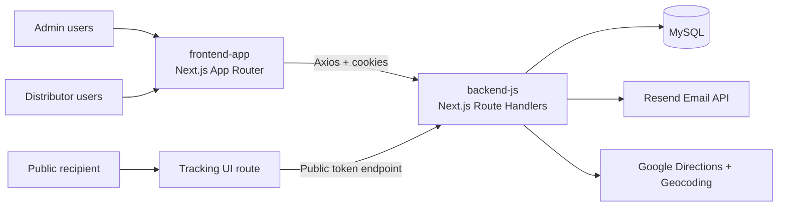

# PakAG Engineering Documentation

Welcome to the technical handbook for **PakAG**, the package distribution and tracking platform in this monorepo.

> [!NOTE]
> This documentation is generated from the actual repository structure under `backend-js` and `frontend-app` and is intended for onboarding new developers quickly.

## What you will find here

- Complete architecture and codebase orientation.
- Verified backend and frontend implementation patterns.
- API and authentication flows.
- Environment, deployment, troubleshooting, and contribution workflows.
- AI collaboration rules for docs maintenance.

## Quick path

| If you are... | Start here | Then read |
|---|---|---|
| New to the project | [Project Overview](/en/project) | [Monorepo Structure](/en/monorepo) |
| Setting up locally | [Local Setup](/en/setup) | Backend or frontend docs for your area |
| Changing an API flow | [API Reference](/en/api) | [Backend Documentation](/en/backend) |
| Working on UI behavior | [Frontend Documentation](/en/frontend) | Related API endpoint docs |

## Quick links

- [Project Overview](/en/project)
- [Monorepo Structure](/en/monorepo)
- [Local Setup](/en/setup)
- [Backend Documentation](/en/backend)
- [Frontend Documentation](/en/frontend)
- [API Reference](/en/api)

## Maintenance checklist

Before publishing documentation changes, confirm:

- [ ] The same content exists in English, Spanish, and Basque.
- [ ] Links match the current route structure.
- [ ] Code, API names, and folder paths match the repository.
- [ ] New sections stay short, scannable, and useful for onboarding.
- [ ] Diagrams are preserved or updated in all affected locales.

## High-level system diagram

