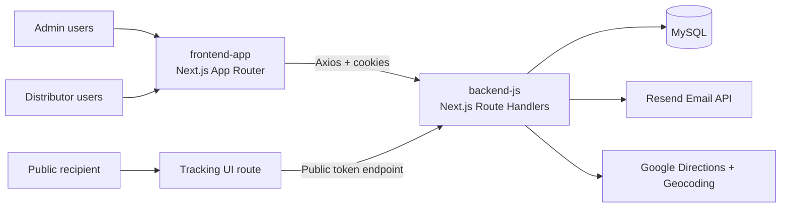

# PakAG Engineering Documentation

Welcome to the technical handbook for **PakAG**, the package distribution and tracking platform in this monorepo.

> [!NOTE]
> This documentation is generated from the actual repository structure under `backend-js` and `frontend-app` and is intended for onboarding new developers quickly.

## What you will find here

- Complete architecture and codebase orientation.
- Verified backend and frontend implementation patterns.
- API and authentication flows.
- Environment, deployment, troubleshooting, and contribution workflows.
- AI collaboration rules for docs maintenance.

## Quick links

- [Project Overview](/project)
- [Monorepo Structure](/monorepo)
- [Local Setup](/setup)
- [Backend Documentation](/backend)
- [Frontend Documentation](/frontend)
- [API Reference](/api)

## High-level system diagram

