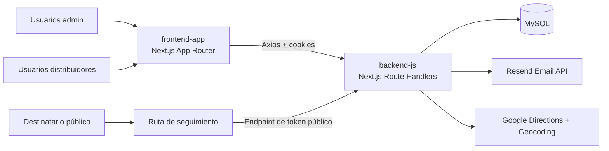

# Documentación de Ingeniería PakAG

Bienvenido al manual técnico de **PakAG**, la plataforma de distribución y seguimiento de paquetes en este monorepo.

> [!NOTE]
> Esta documentación se genera a partir de la estructura real del repositorio bajo `backend-js` y `frontend-app` y está destinada a incorporar nuevos desarrolladores rápidamente.

## Qué encontrarás aquí

- Orientación completa de la arquitectura y el código.
- Patrones de implementación verificados de backend y frontend.
- Flujos de API y autenticación.
- Flujos de entorno, despliegue, resolución de problemas y contribución.
- Reglas de colaboración con IA para el mantenimiento de la documentación.

## Ruta rápida

| Si estás... | Empieza aquí | Después lee |
|---|---|---|
| Conociendo el proyecto | [Visión general del proyecto](/es/project) | [Estructura del monorepo](/es/monorepo) |
| Configurando el entorno local | [Configuración local](/es/setup) | La documentación de backend o frontend según tu área |
| Cambiando un flujo de API | [Referencia de API](/es/api) | [Documentación del backend](/es/backend) |
| Trabajando en comportamiento de UI | [Documentación del frontend](/es/frontend) | La documentación de los endpoints relacionados |

## Accesos rápidos

- [Visión general del proyecto](/es/project)
- [Estructura del monorepo](/es/monorepo)
- [Configuración local](/es/setup)
- [Documentación del backend](/es/backend)
- [Documentación del frontend](/es/frontend)
- [Referencia de API](/es/api)

## Checklist de mantenimiento

Antes de publicar cambios de documentación, confirmá:

- [ ] El mismo contenido existe en inglés, castellano y euskera.
- [ ] Los enlaces coinciden con la estructura actual de rutas.
- [ ] Los nombres de código, API y carpetas coinciden con el repositorio.
- [ ] Las secciones nuevas son breves, escaneables y útiles para onboarding.
- [ ] Los diagramas se conservan o se actualizan en todos los locales afectados.

## Diagrama del sistema de alto nivel

