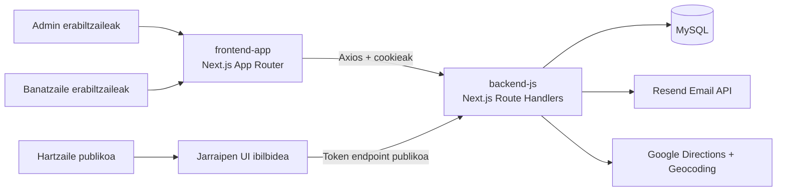

# PakAG Ingeniaritza Dokumentazioa

Ongi etorri **PakAG**-ren eskuliburu teknikora, monorepo honetan dagoen pakete-banaketa eta -jarraipen plataformarena.

> [!NOTE]
> Dokumentazio hau `backend-js` eta `frontend-app` azpiko benetako biltegiaren egituratik sortzen da eta garatzaile berriak azkar txertatzeko diseinatua dago.

## Zer aurkituko duzu hemen

- Arkitekturaren eta kode-basearen orientabide osoa.
- Egiaztaturiko backend eta frontend inplementazio-ereduak.
- API eta autentikazio-fluxuak.
- Ingurunea, hedapena, arazoak konpontzeko eta ekarpenerako fluxuak.
- IA lankidetzarako arauak dokumentazioaren mantentzerako.

## Bide azkarra

| Bazaude... | Hasi hemen | Ondoren irakurri |
|---|---|---|
| Proiektua ezagutzen | [Proiektuaren ikuspegi orokorra](/eus/project) | [Monorepoaren egitura](/eus/monorepo) |
| Tokiko ingurunea prestatzen | [Tokiko konfigurazioa](/eus/setup) | Zure arloko backend edo frontend dokumentazioa |
| API fluxu bat aldatzen | [API erreferentzia](/eus/api) | [Backend dokumentazioa](/eus/backend) |
| UI portaeran lanean | [Frontend dokumentazioa](/eus/frontend) | Lotutako endpointen dokumentazioa |

## Esteka azkarrak

- [Proiektuaren ikuspegi orokorra](/eus/project)
- [Monorepoaren egitura](/eus/monorepo)
- [Tokiko konfigurazioa](/eus/setup)
- [Backend dokumentazioa](/eus/backend)
- [Frontend dokumentazioa](/eus/frontend)
- [API erreferentzia](/eus/api)

## Mantentze-checklista

Dokumentazio aldaketak argitaratu aurretik, egiaztatu:

- [ ] Eduki bera ingelesez, gaztelaniaz eta euskaraz dago.
- [ ] Estekek uneko ibilbide-egiturarekin bat egiten dute.
- [ ] Kode, API eta karpeten izenak biltegiarekin bat datoz.
- [ ] Atal berriak laburrak, eskaneatzeko errazak eta onboarding-erako erabilgarriak dira.
- [ ] Diagramak mantentzen dira edo eragindako locale guztietan eguneratzen dira.

## Sistemaren goi-mailako diagrama

